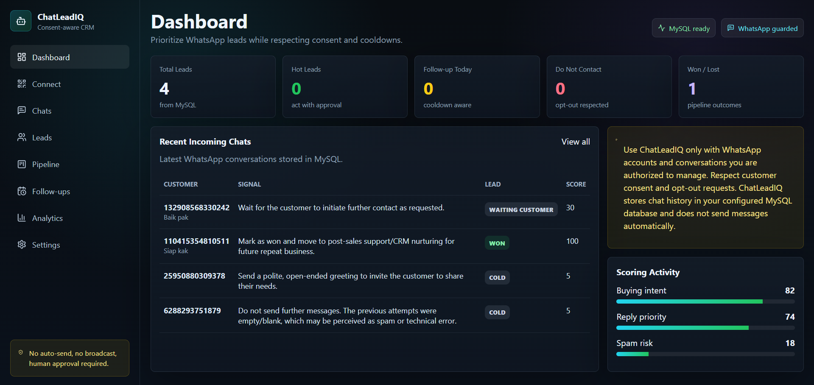
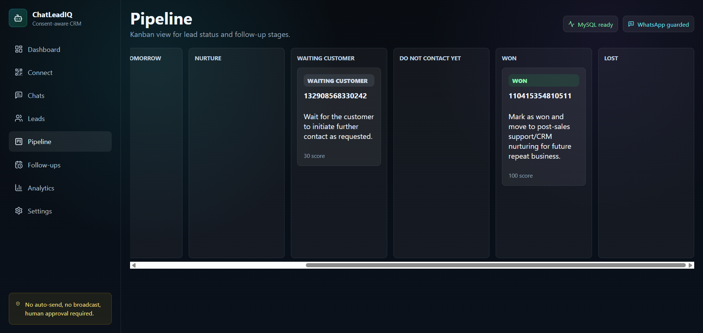
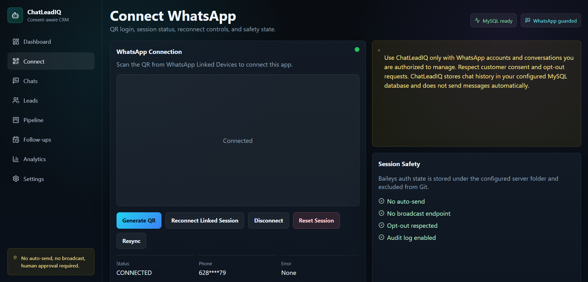

# ChatLeadIQ

Open-source, consent-aware AI lead scoring CRM for authorized WhatsApp sales conversations.


ChatLeadIQ helps sales teams understand legitimate WhatsApp conversations by syncing authorized chat history, analyzing buying intent, detecting objections, prioritizing leads, and drafting follow-up replies that require human review before sending.

It is designed for ethical sales assistance, not automation abuse.

## Screenshots

> Add real screenshots before submitting to OSS programs.





## Project Status

ChatLeadIQ is in active MVP development. The current codebase targets a practical, reviewable open-source prototype rather than a guaranteed production-ready system.

Core modules currently available or under active development include:

- WhatsApp QR connection via Baileys.
- MySQL + Prisma data layer.
- AI lead analysis.
- Next.js dashboard UI.
- Draft-only suggested replies.
- Consent-aware safeguards.

Production deployments should review WhatsApp/Meta terms, local privacy regulations, data retention requirements, hosting security, and operational reliability before handling real customer data.

## Why It Exists

WhatsApp is a primary sales channel in many markets, but high-intent leads often get buried inside long chat histories. Sales teams need a structured way to review customer context without turning outreach into spam.

ChatLeadIQ converts authorized WhatsApp conversations into a lightweight CRM workflow:

- Read recent and historical chat context.
- Identify buying intent, urgency, objections, and follow-up needs.
- Summarize lead state for sales teams.
- Draft helpful replies without sending them automatically.
- Respect opt-out signals, cooldowns, and do-not-contact states.

## Key Features

- WhatsApp QR connection through Baileys.
- MySQL storage for contacts, chats, messages, leads, analysis, follow-ups, and audit logs.
- AI-first analyzer that reads conversation history and scores lead parameters.
- OpenAI or Gemini provider support with structured output validation.
- Optional rule fallback for safer behavior when configured.
- Lead statuses such as hot, warm, follow-up, nurture, waiting customer, price objection, won, lost, and do-not-contact.
- Buying intent scoring, urgency detection, objection detection, spam risk scoring, and next-best-action recommendations.
- Suggested replies are generated as drafts only.
- Consent-aware safeguards, opt-out detection, cooldown rules, and audit logging.
- Dark-mode CRM dashboard with chats, leads, pipeline, follow-ups, analytics, settings, and WhatsApp connect pages.

## How It Works

1. User logs in to the dashboard.
2. User connects an authorized WhatsApp account using QR login.
3. Backend syncs authorized chat messages through Baileys.
4. Messages are stored in the user's MySQL database via Prisma.
5. AI analyzer reviews chat history and updates lead status, score, objections, and suggested next actions.
6. Dashboard presents prioritized leads and draft-only suggested replies.
7. A human reviews the recommendation before taking any action.

## Architecture

```text
WhatsApp Web / Baileys
        |
        v
Node.js API + Socket.IO
        |
        v
MySQL + Prisma
        |
        v
AI Analyzer
        |
        v
Next.js CRM Dashboard
        |
        v
Human-approved follow-up
```

The AI analyzer scores and summarizes conversations, but it does not send WhatsApp messages automatically. Suggested replies remain drafts that require human approval.

## No Auto-Spam Policy

ChatLeadIQ is not a spammer.

It is not:

- A bulk sender.
- A contact scraper.
- An auto-reply bot.
- A broadcast engine.
- A tool for unsolicited messaging.

The default `ENABLE_AUTO_SEND=false` is intentional. The application does not expose a broadcast endpoint, and suggested replies require human approval before any message is sent.

Any contribution that turns ChatLeadIQ into a spam, scraping, or unauthorized automation tool is out of scope.

## Privacy Principles

- Only authorized WhatsApp conversations should be connected.
- Chat data is stored in the user's own MySQL database.
- API keys remain in server or local environment variables.
- Suggested replies are draft-only.
- Contacts can be marked as do-not-contact.
- Users are responsible for following WhatsApp/Meta terms and local privacy laws.

## OpenAI / Gemini Usage

OpenAI and Gemini API keys are optional. The analyzer can be configured through environment variables and can use AI providers for structured lead scoring, summarization, objection detection, urgency detection, multilingual suggested replies, and safer follow-up recommendations.

Rule fallback exists for safer behavior when AI is disabled or configured to allow fallback. When `AI_ANALYZER_REQUIRED=true`, lead status and scoring are expected to come from AI reasoning instead of silent rule-only classification.

API credits would be used for:

- Lead scoring and status classification.
- Chat summarization.
- Objection and urgency detection.
- Multilingual draft reply generation.
- Documentation improvements.
- Test expansion.
- Issue triage and PR review.

## Example AI Output

Suggested replies are drafts only. They are not sent automatically.

```json
{
  "leadStatus": "hot",
  "buyingIntentScore": 92,
  "urgency": "high",
  "objection": null,
  "nextAction": "Send invoice and payment details",
  "suggestedReply": "Baik, kami siapkan invoice dan nomor rekeningnya sekarang.",
  "safety": {
    "requiresHumanApproval": true,
    "autoSend": false
  }
}
```

## Repository Structure

```text
apps/api   Express, Socket.IO, Prisma, Baileys, analyzer
apps/web   Next.js dashboard and landing page
docs       Architecture, privacy, deployment, scoring docs
```

## Local Installation

1. Install Node.js 20+ and pnpm.
2. Create a MySQL database:

```sql
CREATE DATABASE chatleadiq CHARACTER SET utf8mb4 COLLATE utf8mb4_unicode_ci;
```

3. Copy `.env.example` to `.env`.
4. Set `DATABASE_URL=mysql://root:@localhost:3306/chatleadiq`.
5. Install dependencies and prepare Prisma:

```bash
pnpm install
pnpm db:generate
pnpm db:push
pnpm db:seed
pnpm dev
```

6. Open frontend `http://localhost:3000` and backend `http://localhost:4000`.
7. Login with `ADMIN_EMAIL` and `ADMIN_PASSWORD`, then open `/connect`, generate a QR, and scan it from WhatsApp Linked Devices.

## XAMPP / Local MySQL

Start Apache/MySQL from XAMPP, open phpMyAdmin, create the `chatleadiq` database, and use:

```env
DATABASE_URL=mysql://root:@localhost:3306/chatleadiq
```

## MySQL Hosting

Create a database/user from your hosting panel and set:

```env
DATABASE_URL=mysql://db_user:db_password@db_host:3306/db_name
```

Use utf8mb4 charset when available. The Prisma schema uses `LongText` instead of native JSON for broad cPanel/MySQL compatibility.

## Environment Variables

See `.env.example` for all variables. Important values:

- `JWT_SECRET`: change before production.
- `ADMIN_EMAIL`: dashboard login email for the initial admin account.
- `ADMIN_PASSWORD`: dashboard login password for the initial admin account.
- `NEXT_PUBLIC_API_URL`: frontend API URL.
- `DATABASE_URL`: local or hosted MySQL connection string.
- `BAILEYS_AUTH_DIR`: writable server folder for WhatsApp session auth.
- `BAILEYS_BROWSER`: browser identity used by Baileys.
- `OPENAI_API_KEY`: optional.
- `GEMINI_API_KEY`: optional.
- `ENABLE_AI_ANALYZER`: AI enhancement toggle.
- `AI_ANALYZER_REQUIRED`: keep `true` when status/scoring must come from AI reasoning, not rule fallback.
- `AI_PROVIDER`: `auto`, `openai`, or `gemini`.
- `OPENAI_MODEL` / `GEMINI_MODEL`: model selection.
- `ANALYSIS_DEBOUNCE_MS`: delay before analyzing a chat after new messages arrive.
- `ANALYSIS_BACKFILL_BATCH_SIZE`: number of existing chats queued when WhatsApp connects or resync runs.
- `ENABLE_AUTO_SEND`: keep `false`.
- `FOLLOWUP_COOLDOWN_HOURS`: default 24.

Never commit real `.env` files, API keys, Baileys auth state, database dumps, or chat exports.

## API Overview

- `GET /health`
- `POST /api/auth/login`
- `GET /api/database/status`
- `GET /api/whatsapp/status`
- `GET /api/whatsapp/qr`
- `POST /api/whatsapp/connect`
- `POST /api/whatsapp/disconnect`
- `POST /api/whatsapp/resync`
- `POST /api/analysis/run`
- `POST /api/analysis/backfill`
- `GET /api/chats`
- `POST /api/chats/:id/analyze`
- `GET /api/leads`
- `GET /api/leads/:id`
- `POST /api/leads/:id/do-not-contact`
- `GET /api/followups/today`
- `PATCH /api/settings`
- `GET /api/export/leads.csv`

## Docker

```bash
docker compose up --build
```

Services: MySQL 8, API, and web. The API mounts `./data:/app/data` for Baileys session storage.

## Web Hosting / VPS Deployment

ChatLeadIQ requires:

- Node.js long-running process support.
- WebSocket support.
- Writable file system for Baileys auth state.
- MySQL.
- Environment variables.

PHP-only or static shared hosting cannot run the full app.

For cPanel Node.js App, upload the repo, install dependencies, build, use `apps/api/dist/index.js` as backend startup file, configure env vars, point `DATABASE_URL` to hosting MySQL, and ensure `BAILEYS_AUTH_DIR` is writable.

For VPS, install Node.js 20+, pnpm, MySQL, clone repo, set `.env`, run Prisma commands, build, run API and web with PM2, add Nginx reverse proxy, and enable HTTPS.

## Testing

```bash
pnpm test
pnpm lint
pnpm typecheck
```

Testing coverage is being expanded. Recommended test areas include:

- Lead scoring logic.
- Opt-out detection.
- Cooldown rules.
- Draft-only reply generation.
- Analyzer fallback behavior.
- API validation.

## Roadmap

- [x] WhatsApp QR connection via Baileys.
- [x] MySQL + Prisma data layer.
- [x] Next.js dashboard UI.
- [x] AI lead analysis.
- [x] Draft-only suggested replies.
- [x] Consent-aware safeguards.
- [x] API endpoints for chats, leads, analysis, follow-ups, settings, and export.
- [ ] Official WhatsApp Business API adapter.
- [ ] Encrypted chat storage.
- [ ] Custom scoring rules UI.
- [ ] Calendar reminders.

## Contributing

Issues and PRs are welcome. Please keep changes aligned with the no-auto-spam policy and add tests for analyzer logic, consent handling, and other sensitive workflows.

Good first issues:

- Add dashboard screenshots.
- Improve analyzer test coverage.
- Add multilingual reply examples.
- Improve deployment docs.
- Add objection detection examples.
- Improve documentation for privacy-safe workflows.

Before opening a PR:

- Run `pnpm lint`.
- Run `pnpm typecheck`.
- Run `pnpm test`.
- Avoid committing secrets, auth state, logs, or database exports.
- Make sure suggested replies remain draft-only unless a future reviewed design explicitly preserves human approval.

## Security

Read `SECURITY.md`.

Never commit:

- `.env` files.
- API keys.
- `data/`.
- Baileys auth state.
- Logs.
- Database dumps.
- Chat exports containing personal data.

Use strong `JWT_SECRET` values, restrict database access, protect server environment variables, and review hosting permissions before deploying.

## Ethical Use

Read `ETHICAL_USE.md`.

Use only WhatsApp accounts and conversations you are authorized to manage. Respect opt-out requests, avoid unsolicited messaging, and keep humans responsible for outbound communication decisions.

## Disclaimer

Baileys is an unofficial WhatsApp Web library. Follow WhatsApp/Meta terms and local messaging/privacy regulations. ChatLeadIQ does not guarantee compliance for your specific jurisdiction.

This project is provided as open-source software for ethical CRM assistance and research. Operators are responsible for how they deploy, configure, and use it.

## License

MIT
